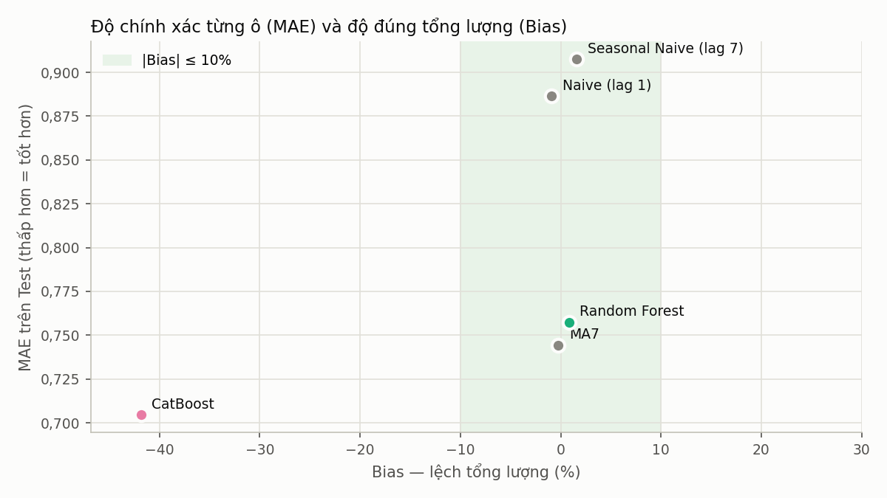
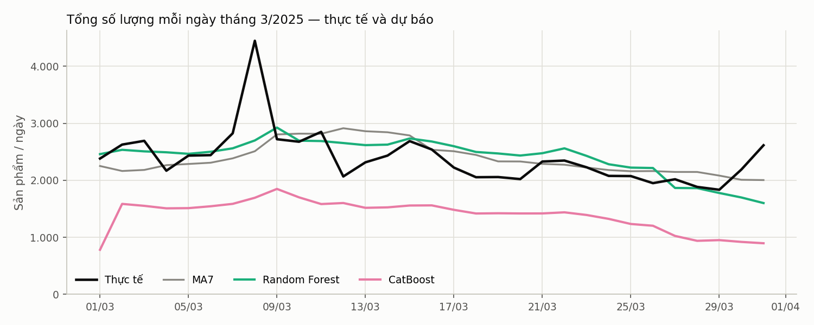

# Kết quả dự báo lượng bán — so sánh mô hình

Dự báo `so_luong` (số sản phẩm bán) mỗi ngày cho từng cặp **cửa hàng × nhóm hàng** của chuỗi Genbyte, Q1/2025. Ba baseline và năm mô hình học máy (Ridge, Poisson, Random Forest, XGBoost, CatBoost) dùng **cùng bảng, cùng đặc trưng, cùng mốc chia, cùng hàm chấm điểm**: tối ưu trên Validation 15–28/02, train lại trên 15/01–28/02, chấm trên Test tháng 3.

> 🔄 Bảng, biểu đồ và nhận định tự động được sinh lại bằng `python module5/tao_bao_cao.py` từ `bao_cao/du_lieu/` — **không sửa tay các khối này** (bị ghi đè mỗi lần chạy). Phần viết tay: *Cách đọc chỉ số*, ghi chú ở mục 3, 8, 9 và *Kết luận và khuyến nghị*. Cách nộp kết quả một mô hình: [README → Nộp kết quả vào báo cáo](../README.md#nộp-kết-quả-vào-báo-cáo).

<!-- TU_DONG:trang_thai -->
> **Cập nhật tự động 09/10/2026 14:23** · Test 01/03–31/03/2025: 67.146 ô, tổng thực tế 74.196 sản phẩm · bảng mô hình tổng 216.592 sản phẩm — giữ: bán buôn, khu vực Khác, trả lại; bỏ: không
>
> **Đã nộp 2/5:** ⬜ Ridge · ⬜ Poisson · ✅ Random Forest · ⬜ XGBoost · ✅ CatBoost  
> **Kiểm tra so sánh công bằng:** ✔ cùng bảng, cùng tập Test, cùng baseline
<!-- /TU_DONG -->

## 1. Tóm tắt

<!-- TU_DONG:tom_tat -->
- **MAE thấp nhất:** CatBoost 0,705 (MA7 0,744) · **WAPE thấp nhất:** CatBoost 0,638 (MA7 0,674).
- **RMSE thấp nhất:** Random Forest 4,743 (MA7 4,975) · **R² cao nhất:** Random Forest 0,423 (MA7 0,365).
- **Thắng MA7 về MAE:** CatBoost · **thua MA7:** Random Forest (MAE +1,8%).
- **Lệch tổng lượng quá 10% (|Bias|):** CatBoost (−41,9%).
- **Theo tiêu chí đề xuất (MAE thấp nhất trong các mô hình có |Bias| ≤ 10%):** **MA7** — chưa mô hình học máy nào vượt MA7 khi xét cả tổng lượng.
- **Chưa nộp:** Ridge, Poisson, XGBoost — kết luận dưới đây là tạm thời.
<!-- /TU_DONG -->

## 2. So sánh trên tập Test

<!-- TU_DONG:bang_test -->
| Mô hình | MAE | RMSE | WAPE | R² | Bias | WAPE so với MA7 | WAPE < MA7 (nhóm hàng · cửa hàng) |
|---|---:|---:|---:|---:|---:|---:|---:|
| Naive (lag 1) | 0,887 | 6,675 | 0,802 | −0,142 | −0,9% | +19,1% | — |
| Seasonal Naive (lag 7) | 0,908 | 6,728 | 0,821 | −0,160 | +1,6% | +21,9% | — |
| MA7 | 0,744 | 4,975 | 0,674 | 0,365 | **−0,2%** | — | — |
| **Random Forest** | 0,757 | **4,743** | 0,686 | **0,423** | +0,8% | +1,8% | 4/23 · 22/130 |
| **CatBoost** | **0,705** | 5,673 | **0,638** | 0,175 | −41,9% ⚠️ | −5,3% | 21/23 · 124/130 |

In đậm = tốt nhất mỗi cột · ⚠️ = lệch tổng lượng quá 10%.

<!-- /TU_DONG -->

**Cách đọc chỉ số**

| Chỉ số | Ý nghĩa | Tốt khi |
|---|---|---|
| MAE | Sai số tuyệt đối trung bình mỗi ô (sản phẩm/ô/ngày) | Thấp |
| RMSE | Như MAE nhưng phạt nặng sai số lớn — nhạy với ô bán buôn đột biến | Thấp |
| WAPE | Tổng sai số tuyệt đối / tổng lượng bán thực tế | Thấp |
| R² | Phần biến động giải thích được so với đoán mọi ô bằng trung bình; < 0 là tệ hơn trung bình | Cao |
| Bias | Tổng dự báo / tổng thực tế − 1; âm = dự báo thiếu hàng | Gần 0 |

Baseline: **Naive** = lượng bán hôm qua (`lag_1`) · **Seasonal Naive** = cùng thứ tuần trước (`lag_7`) · **MA7** = trung bình 7 ngày trước (`tb_7`). MA7 là mốc chính: một mô hình chỉ có giá trị khi tốt hơn MA7.

## 3. Chọn mô hình

<!-- TU_DONG:chon_mo_hinh -->
| Tiêu chí | Tốt nhất (gồm baseline) | Mô hình học máy tốt nhất | Hơn MA7? |
|---|---|---|---:|
| MAE thấp nhất | CatBoost (0,705) | CatBoost (0,705) | ✔ |
| WAPE thấp nhất | CatBoost (0,638) | CatBoost (0,638) | ✔ |
| RMSE thấp nhất | Random Forest (4,743) | Random Forest (4,743) | ✔ |
| R² cao nhất | Random Forest (0,423) | Random Forest (0,423) | ✔ |
| \|Bias\| nhỏ nhất (đúng tổng lượng) | MA7 (−0,2%) | Random Forest (+0,8%) | ✘ |
| **MAE thấp nhất trong các mô hình có \|Bias\| ≤ 10% (đề xuất)** | **MA7** (0,744) | Random Forest (0,757) | ✘ |
<!-- /TU_DONG -->

*Ghi chú:* tiêu chí chính thức **chưa chốt**. Với dữ liệu thưa (≈ 70% ô bằng 0), chọn chỉ theo MAE/WAPE sẽ ưu tiên mô hình dự báo gần 0 và thiếu hàng hệ thống. Đề xuất: chọn MAE thấp nhất trong các mô hình có |Bias| ≤ 10%.

## 4. Tối ưu tham số: Validation → Test

<!-- TU_DONG:validation -->
| Mô hình | Cấu hình chọn | Số cấu hình thử | MAE Val | MA7 Val | MAE Test | MA7 Test | So với MA7: Val → Test |
|---|---|---:|---:|---:|---:|---:|---:|
| Random Forest | `n_estimators=300, min_samples_leaf=20, max_features=sqrt, max_depth=8, criterion=squared_error` | 12 | 0,868 | 0,847 | 0,757 | 0,744 | ✘ thua → ✘ thua |
| CatBoost | `loss_function=MAE, learning_rate=0.05, l2_leaf_reg=3, depth=6, iterations=52` | 12 | 0,745 | 0,847 | 0,705 | 0,744 | ✔ thắng → ✔ thắng |
<!-- /TU_DONG -->

## 5. Tổng lượng dự báo

<!-- TU_DONG:tong_luong -->

**Tổng lượng (sản phẩm), chia theo lượng bán thực tế của ô:**

| Tổng lượng | Thực tế | MA7 | Random Forest | CatBoost |
|---|---:|---:|---:|---:|
| Trung bình / ngày toàn hệ thống | 2.393 | 2.388 | 2.413 | 1.392 |
| Ô bán 0 (46.477 ô) | 0 | 11.195 | 13.297 | 3.640 |
| Ô bán 1–4 (16.489 ô) | 28.742 | 25.901 | 25.906 | 17.328 |
| Ô bán 5–19 (3.902 ô) | 31.884 | 26.013 | 24.990 | 19.147 |
| Ô bán ≥ 20 (278 ô) | 13.570 | 10.904 | 10.622 | 3.022 |

**MAE theo quy mô ô** (in đậm = tốt nhất mỗi dòng):

| Quy mô ô | MA7 | Random Forest | CatBoost |
|---|---:|---:|---:|
| Ô bán 0 | 0,241 | 0,286 | **0,078** |
| Ô bán 1–4 | 1,092 | **1,050** | 1,151 |
| Ô bán 5–19 | 3,164 | **3,092** | 3,626 |
| Ô bán ≥ 20 | 30,331 | **29,468** | 37,941 |

- **Random Forest** tốt hơn MA7 ở ô 1–4, 5–19, ≥ 20; kém hơn ở ô 0. Ô bán ≥ 20: dự báo 10.622 so với thực tế 13.570 (MA7 10.904).
- **CatBoost** tốt hơn MA7 ở ô 0; kém hơn ở ô 1–4, 5–19, ≥ 20. Ô bán ≥ 20: dự báo 3.022 so với thực tế 13.570 (MA7 10.904).
<!-- /TU_DONG -->

## 6. Theo nhóm hàng

<!-- TU_DONG:nhom_hang -->
| Nhóm hàng | Thực tế | MA7 | Random Forest | CatBoost |
|---|---:|---:|---:|---:|
| Điện thoại | 24.577 | 0,559 | **0,533** | 0,588 |
| Phụ kiện | 19.610 | 0,507 | **0,498** | 0,539 |
| Hcare (bảo hành) | 12.288 | 0,552 | **0,547** | 0,549 |
| Tai nghe | 3.663 | 0,845 | 0,841 | **0,767** |
| Màn hình | 2.473 | 0,940 | 0,956 | **0,821** |
| Máy tính bảng | 2.343 | 1,112 | 1,130 | **0,898** |
| Đồng hồ | 2.211 | 1,020 | 1,064 | **0,843** |
| Laptop | 1.516 | 1,258 | 1,279 | **0,960** |
| 15 nhóm hàng còn lại | 5.515 | 1,331 | 1,614 | **0,957** |
| **Thắng MA7** |  |  | 4/23 | 21/23 |

Giá trị là WAPE (thấp hơn = tốt hơn), in đậm = tốt nhất mỗi dòng · *Thắng MA7* = số nhóm hàng có WAPE thấp hơn MA7.

- **Random Forest** thắng MA7 ở 4/23 nhóm, chiếm 81% lượng bán; Điện thoại 0,533 vs 0,559 ✔, Phụ kiện 0,498 vs 0,507 ✔, Hcare (bảo hành) 0,547 vs 0,552 ✔.
- **CatBoost** thắng MA7 ở 21/23 nhóm, chiếm 40% lượng bán; Điện thoại 0,588 vs 0,559 ✘, Phụ kiện 0,539 vs 0,507 ✘, Hcare (bảo hành) 0,549 vs 0,552 ✔.
<!-- /TU_DONG -->

## 7. Theo khu vực

<!-- TU_DONG:khu_vuc -->
| Khu vực | Thực tế | MA7 | Random Forest | CatBoost |
|---|---:|---:|---:|---:|
| KVHN2 | 12.430 | **0,551** | 0,556 | 0,586 |
| KVHN1 | 12.183 | 0,519 | **0,515** | 0,517 |
| Khác - Online | 9.927 | 0,769 | **0,739** | 0,787 |
| KVHN3 | 8.521 | 0,540 | 0,540 | **0,517** |
| KVMB1 | 4.518 | 0,790 | 0,834 | **0,686** |
| KVMB2 | 3.637 | 0,754 | 0,783 | **0,668** |
| KVMTR3 | 3.331 | 0,791 | 0,827 | **0,694** |
| KVMTR1 | 3.223 | 0,752 | 0,770 | **0,660** |
| KVMN2 | 3.052 | 0,711 | 0,748 | **0,634** |
| KVHCM1 | 2.999 | 0,838 | 0,887 | **0,730** |
| KVMTR2 | 2.823 | 0,695 | 0,732 | **0,642** |
| KVHCM2 | 2.704 | 0,886 | 0,925 | **0,761** |
| KVMN1 | 2.415 | 0,840 | 0,877 | **0,713** |
| KVMN3 | 2.022 | 0,882 | 0,937 | **0,766** |
| Khác - Dịch vụ sửa chữa | 411 | 0,830 | 0,866 | **0,695** |
| **Thắng MA7** |  |  | 2/15 | 13/15 |

Giá trị là WAPE (thấp hơn = tốt hơn), in đậm = tốt nhất mỗi dòng · *Thắng MA7* = số khu vực có WAPE thấp hơn MA7.
<!-- /TU_DONG -->

## 8. Đặc trưng quan trọng

<!-- TU_DONG:dac_trung -->
| Nhóm đặc trưng | Random Forest | CatBoost |
|---|---:|---:|
| Bán gần đây (lag, trung bình, độ lệch chuẩn) | 96% | 80% |
| Lịch (thứ, cuối tuần, ngày trong tháng, Tết) | 3% | 20% |
| Mã cửa hàng / nhóm hàng / vùng | 1% | 1% |
| Top 3 đặc trưng | `tb_14` 21,3% `tb_7` 20,1% `std_14` 16,1% | `tb_14` 35,9% `tb_7` 17,1% `lag_1` 15,8% |

Tỷ trọng mức quan trọng (Ridge/Poisson: trị tuyệt đối hệ số trên đặc trưng chuẩn hoá), mỗi cột cộng lại 100%.
<!-- /TU_DONG -->

*Ghi chú:* `tb_7`, `tb_14` là lượng bán trung bình 7 / 14 ngày liền trước (ngày không bán tính là 0); `std_7`, `std_14` là độ lệch chuẩn trên cùng cửa sổ; `lag_k` là lượng bán k ngày trước. Mọi đặc trưng chỉ dùng quá khứ (dời ≥ 1 ngày).

## 9. R² âm và bộ lọc giao dịch

<!-- TU_DONG:r2 -->
R² = 1 − (tổng bình phương sai số) / (tổng bình phương độ lệch so với trung bình Test). **R² < 0 nghĩa là dự báo tệ hơn việc đoán mọi ô bằng trung bình tập Test** — không phải lỗi tính, và không cắt về 0.

| Có R² âm | R² | 10 ô sai nhiều nhất chiếm | Cửa hàng chiếm nhiều nhất |
|---|---:|---:|---:|
| Naive (lag 1) | −0,142 | 79% | HN007 (76%) |
| Seasonal Naive (lag 7) | −0,160 | 81% | HN007 (79%) |
<!-- /TU_DONG -->

*Ghi chú (viết tay, phân tích ngày 09/10/2026):* phần lớn sai số này đến từ **đơn bán buôn** — một ngày đơn lớn ở HN007 bị Naive lặp sang hôm sau thành hai sai số lớn. Bỏ bán buôn khỏi biến mục tiêu (`tao_bang_ngay(..., bo_ban_buon=True)`) thì R² của cả 3 baseline trên Test đều dương; đây là quyết định chung của nhóm, **chưa áp dụng**:

| Bảng mô hình | Naive | Seasonal Naive | MA7 | Ô lớn nhất trên Test |
|---|---:|---:|---:|---:|
| Giữ tất cả (hiện tại) | −0,142 | −0,160 | 0,365 | 798 |
| **Bỏ bán buôn** | **0,496** | **0,529** | **0,700** | 207 |
| Bỏ khu vực Khác | 0,326 | 0,315 | 0,495 | 456 |
| Bỏ bán buôn + khu vực Khác | 0,485 | 0,476 | 0,688 | 207 |

## 10. Nhận xét của từng module

<!-- TU_DONG:nhan_xet -->

<b>Module 3 · Random Forest</b> — trích mục 5 của <code>module3/Module3_3_random_forest.ipynb</code> (chạy 09/10/2026)

**Thảo luận.**

1. **Random Forest chưa thắng MA7 trên tiêu chí chọn mô hình** — MAE 0,757 so với 0,744, WAPE kém 1,8% (0,686 so với 0,674). Ngược lại RF tốt nhất về RMSE (4,743) và R² (0,423 so với 0,365 của MA7): sai số ở các ô bán lớn nhỏ hơn.
2. **Đúng tổng lượng.** Bias +0,8%: trung bình 2.413 sản phẩm/ngày toàn hệ thống so với thực tế 2.393 (MA7 2.388). Ở 278 ô bán ≥ 20 sản phẩm/ngày (thực tế 13.570), RF dự báo 10.622 — gần MA7 (10.904), khác hẳn CatBoost (3.022).
3. **Thắng MA7 ở 4/23 nhóm hàng, đúng là 4 nhóm lớn nhất** — Điện thoại (WAPE 0,533 so với 0,559), Phụ kiện (0,498 so với 0,507), Hcare (0,547 so với 0,552), Tai nghe (0,841 so với 0,845), chiếm 81% lượng bán tháng 3 — nhưng chỉ 22/130 cửa hàng. Ở 19 nhóm còn lại RF dự báo dư 15% (16.129 so với thực tế 14.058; MA7 14.073), làm tổng sai số tuyệt đối lớn hơn MA7 1.774 sản phẩm, nhiều hơn phần thắng 891 ở 4 nhóm lớn → WAPE tổng kém MA7.
4. **Đặc trưng quan trọng:** trung bình 14 ngày (21,3%), trung bình 7 ngày (20,1%), độ lệch chuẩn 14 ngày (16,1%), lag 1 (14,5%), độ lệch chuẩn 7 ngày (11,7%) — mô hình gần như chỉ dựa vào mức và độ biến động bán gần đây. Lịch và mã cửa hàng/nhóm hàng/vùng cộng lại chưa tới 4% (`ngay_trong_thang` 1,6%), khác CatBoost (`ngay_trong_thang` 12,5%).
5. **So với CatBoost** (cùng bảng, đặc trưng, mốc chia): CatBoost thắng MA7 về MAE/WAPE nhưng dự báo thiếu 42% tổng lượng và thua ở Điện thoại, Phụ kiện; RF giữ đúng tổng lượng và thắng ở chính hai nhóm đó nhưng thua ở nhóm thưa. Nếu nhóm chốt điều kiện |Bias| ≤ 10%, RF là mô hình học máy duy nhất hiện đạt điều kiện, nhưng vẫn chưa thắng MA7 về MAE/WAPE.
6. **R² âm của Naive / Seasonal Naive không phải lỗi tính.** 10 ô chiếm 79% tổng bình phương sai số của Naive; riêng HN007 (online, đơn bán buôn lớn) chiếm 76%. Lặp lại một ô bán buôn đột biến của hôm trước tạo hai sai số lớn, nên tệ hơn dự báo bằng trung bình. Nếu bỏ bán buôn (`tao_bang_ngay(..., bo_ban_buon=True)`), R² của cả 3 baseline trên Test đều dương (Naive 0,496 · Seasonal Naive 0,529 · MA7 0,700) — chờ nhóm chốt bộ lọc.

**Hướng cải thiện:** cấu hình tốt nhất nằm ở biên không gian tìm kiếm (`min_samples_leaf` lớn nhất, `max_depth` nhỏ nhất) → thử cây đơn giản hơn (`min_samples_leaf` 20–100, `max_depth` 4–8).

**Giới hạn:** bảng mô hình chưa lọc bán buôn/online, chỉ 12 cấu hình, một mốc chia; Validation 15–28/02 không đại diện cho Test (R² của MA7: 0,124 trên Validation, 0,365 trên Test).

<b>Module 5 · CatBoost</b> — trích mục 5 của <code>module5/Module5_catboost.ipynb</code> (chạy 09/10/2026)

**Thảo luận.**

1. **CatBoost tốt nhất theo MAE/WAPE** — WAPE thấp hơn MA7 5,3%, thấp hơn ở 21/23 nhóm hàng và 124/130 cửa hàng. Đây là mô hình đầu tiên của nhóm vượt MA7 trên tiêu chí chọn mô hình (Random Forest: MAE 0,757, WAPE 0,686).
2. **Nhưng dự báo thiếu hệ thống 42% tổng lượng** (TB 1.392 sản phẩm/ngày toàn hệ thống so với thực tế 2.393), RMSE và R² kém MA7. Nguyên nhân: loss MAE ước lượng **trung vị**, mà 69% ô bằng 0 → mô hình dự báo gần 0 cho phần lớn ô (dự báo < 0,5 ở 95% ô bằng 0, nhưng cũng ở 41% ô có bán). Với 278 ô bán ≥ 20 sản phẩm/ngày (tổng 13.570), CatBoost chỉ dự báo 3.022, MA7 dự báo 10.904.
3. Vì vậy CatBoost **thua MA7 ở hai nhóm lớn nhất** — Điện thoại (WAPE 0,59 vs 0,56) và Phụ kiện (0,54 vs 0,51) — và thắng chủ yếu ở các nhóm bán thưa, nơi dự báo ≈ 0 đã cho sai số tuyệt đối nhỏ.
4. **Đặc trưng quan trọng:** trung bình 14 ngày (36%), trung bình 7 ngày (17%), lag 1 (16%) — mô hình chủ yếu dựa vào mức bán gần đây. `ngay_trong_thang` (12,5%) và `ngay_toi_tet` (6,6%) cao bất thường: dữ liệu train chỉ có tháng 1–2 nên hai đặc trưng này dễ học riêng giai đoạn Tết; với tháng 3 đó là ngoại suy, cần kiểm tra lại khi có thêm dữ liệu. Mã cửa hàng/vùng gần như không được dùng.
5. **Hàm ý cho nhóm:** chọn mô hình chỉ theo MAE/WAPE sẽ ưu tiên mô hình dự báo thiếu — không dùng được cho bài toán nhập/phân bổ hàng cần đúng tổng lượng. Đề xuất Module 4/5 chốt **tiêu chí chọn mô hình có xét Bias** (vd chỉ xét mô hình có |Bias| ≤ 10%, hoặc chọn theo RMSE/Poisson deviance). Theo tiêu chí đó, cấu hình Tweedie/Poisson của CatBoost (Bias Validation −11% / +5%; MAE Validation 0,853 / 0,877, xấp xỉ MA7 0,847) là ứng viên phù hợp hơn cấu hình MAE.

**Giới hạn:** bảng mô hình chưa lọc bán buôn/online (ô lớn nhất 1.274 sản phẩm), chỉ 12 cấu hình được thử, một mốc chia duy nhất (chưa backtest nhiều tháng).

<!-- /TU_DONG -->

## 11. Kết luận và khuyến nghị

*Viết tay — Module 5 cập nhật mỗi khi có mô hình mới. Bản tạm ngày 09/10/2026 với 2/5 mô hình (Random Forest, CatBoost) trên bảng mô hình chưa lọc.*

**Kết luận hiện tại**

1. **Chưa mô hình học máy nào vượt MA7 một cách trọn vẹn.** CatBoost có MAE thấp nhất (0,705 so với 0,744 của MA7) nhưng dự báo thiếu 42% tổng lượng. Random Forest đúng tổng lượng (+0,8%), tốt nhất về RMSE (4,743) và R² (0,423), nhưng MAE kém MA7 1,8%. Theo tiêu chí đề xuất (MAE thấp nhất trong các mô hình có |Bias| ≤ 10%), MA7 vẫn đứng đầu.
2. **Hai mô hình thắng ở hai phần khác nhau của dữ liệu.** CatBoost thắng nhờ dự báo gần 0 ở 46.477 ô không bán (69% ô Test; MAE 0,078 so với 0,241 của MA7) nhưng kém MA7 ở mọi ô có bán. Random Forest ngược lại: kém MA7 ở ô không bán, tốt hơn MA7 ở mọi ô có bán và ở 4 nhóm hàng lớn nhất (81% lượng bán). Với nhập và phân bổ hàng, ô có bán và tổng lượng mới quyết định — điểm mạnh của Random Forest sát nhu cầu thực tế hơn, dù MAE tổng chưa thắng.
3. **Thông tin chủ yếu đến từ lượng bán gần đây** — 96% mức quan trọng ở Random Forest và 80% ở CatBoost thuộc nhóm lag / trung bình / độ lệch chuẩn. Mô hình hiện gần như là "MA7 tinh chỉnh", nên khó vượt MA7 nhiều với bộ đặc trưng hiện tại.
4. **Validation 15–28/02 chưa đại diện cho Test** (giai đoạn phục hồi sau Tết): R² của MA7 chỉ 0,124 trên Validation so với 0,365 trên Test. Chọn tham số trên Validation này có thể chưa tối ưu cho tháng 3.

**Việc cần nhóm chốt trước khi kết luận cuối**

1. **Bộ lọc giao dịch** — đề xuất bỏ bán buôn: R² của cả 3 baseline thành dương, ô lớn nhất trên Test giảm từ 798 xuống 207 (xem mục 9).
2. **Tiêu chí chọn mô hình** — đề xuất MAE thấp nhất trong các mô hình có |Bias| ≤ 10%; nếu giữ MAE thuần thì phải nêu rõ mô hình được chọn thiếu hàng bao nhiêu.
3. Sau khi chốt: chạy lại Random Forest (mở rộng `min_samples_leaf`, `max_depth`), CatBoost (ưu tiên hàm mất mát Poisson / Tweedie), cùng Ridge, Poisson, XGBoost, rồi nộp lại bằng `nop_ket_qua`.
4. Module 4: cân nhắc backtest nhiều mốc hoặc dời Validation; xem lại `ngay_trong_thang` (CatBoost dựa vào lịch 20%).

**Giá trị thực tế, hạn chế** — ⬜ Module 5 viết khi có đủ 5 mô hình.

## Nguồn số liệu

<!-- TU_DONG:nguon -->
| Mô hình | Module | Ngày chạy | Số liệu đã lọc | Kết quả đầy đủ (không commit) | Notebook |
|---|---|---|---|---|---|
| Ridge | 1 | chưa nộp | — | `outputs/ridge/` | `module1/Module1_ridge.ipynb` |
| Poisson | 2 | chưa nộp | — | `outputs/poisson/` | `module2/Module2_poisson.ipynb` |
| Random Forest | 3 | 09/10/2026 | `bao_cao/du_lieu/rf/` | `outputs/rf/` | `module3/Module3_3_random_forest.ipynb` |
| XGBoost | 4 | chưa nộp | — | `outputs/xgb/` | `module4/Module4_xgboost.ipynb` |
| CatBoost | 5 | 09/10/2026 | `bao_cao/du_lieu/catboost/` | `outputs/catboost/` | `module5/Module5_catboost.ipynb` |
<!-- /TU_DONG -->
